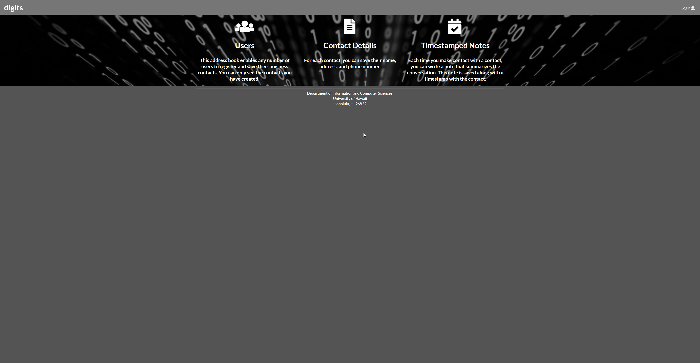
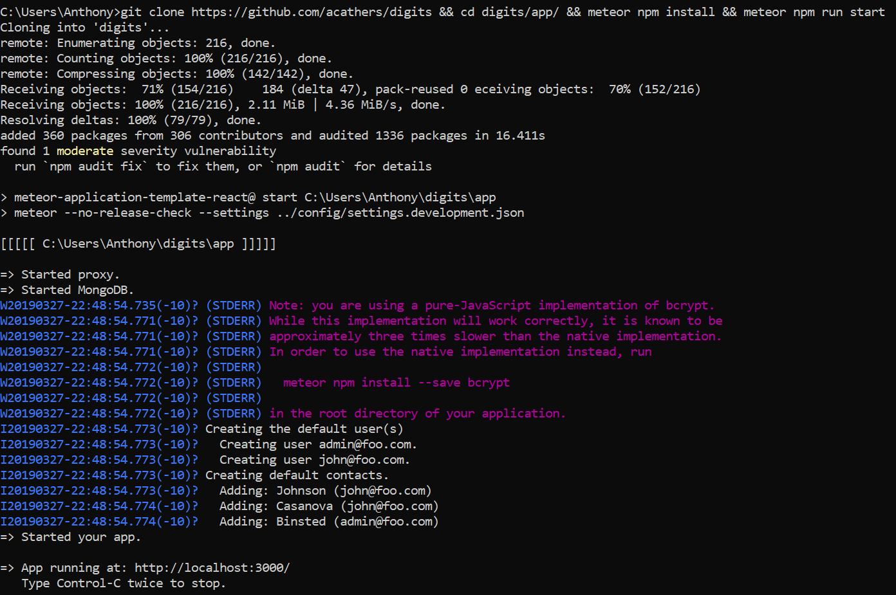
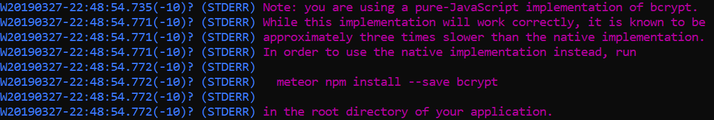
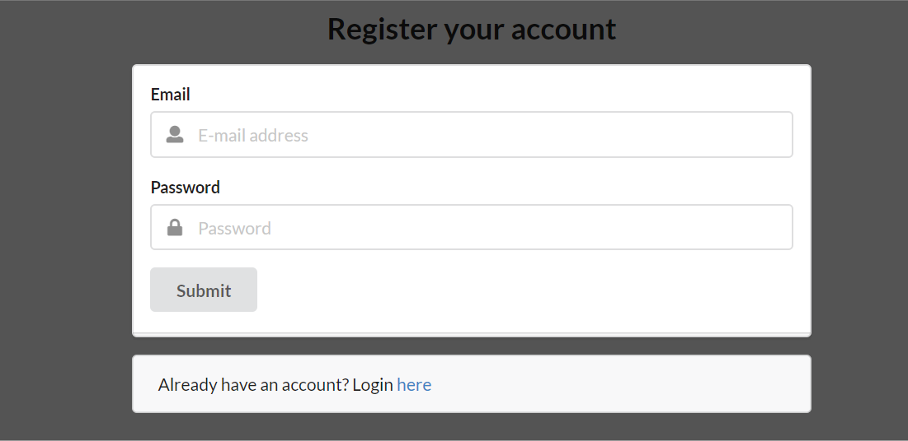
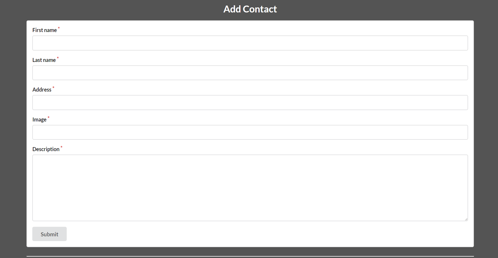
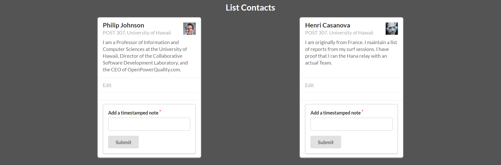

<h2>Introduction</h2>

<p>Digits is an application that allows users to:</p>

<ul>
  <li>Register an account.</li>
  <li>Create and manage a set of contacts.</li>
  <li>Add a set of timestamped notes regarding their interactions with each contact.</li>
</ul>

<h2>Requirements<h2>
<ul>
<li><a href="https://www.meteor.com/install">Meteor installed</a></li>
</ul>

<h2> Installation instructions </h2>

<p>Clone the repository to your preferred location and run</p>
 ```meteor npm install``` <p>from the app directory
then </p>```meteor npm run start``` <p>or if you
prefer to use command line git you can simply paste the below snippit into your console.</p>

```git clone https://github.com/acathers/digits && cd digits/app/ && meteor npm install && meteor npm run start```

if successful you should see something very similar to this</p>



<p>You will notice an error involving bcrypt shown below, this can be safely ignored.</p>



<h2>Walkthrough</h2>

<p>You can click sign up and see a screen like below, enter a email address and password and you're set!</p>


<p>After login you can then click the Add Contact tab at the top left and you can add a contact into the below form</p>



<p>After you have contacts added, you can view them by clicking the List Contacts tab.</p>



<p>From the list contacts tab you can add time-stamped notes to your contacts, or click edit to edit your contact.</p>


